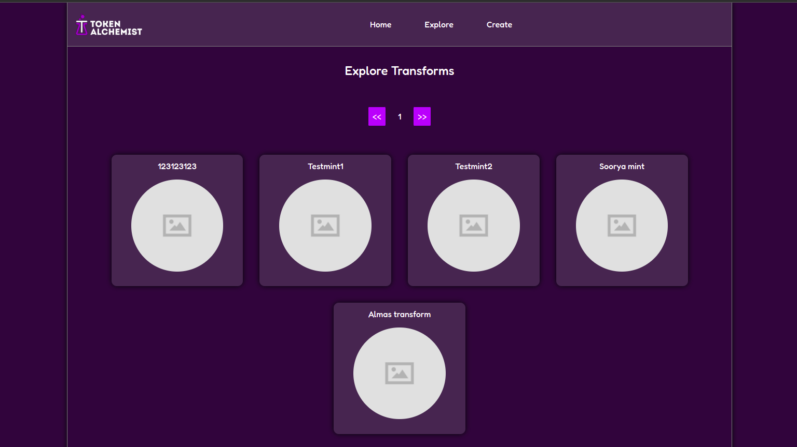

# Tokenitis
Tokenitis enables you to combine or split existing spl-tokens to new spl-tokens.

### Usecases
* NFT packs - combine multiple NFT's into a single NFT
* Gifts - create NFT or token which can be used to redeem something valuable?
* Index funds - combine value multiple assets into a single asset
* Fractional NFT's - Split NFT into fungible tokens
* Easily setup token mints

### Preview 


### Test
```
cargo test -- --nocapture
```

